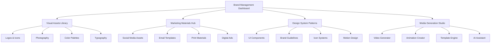

# Gutfit Brand Management System - UI/UX Design Plan

## Executive Summary

This document outlines the comprehensive UI/UX design plan for the Gutfit Brand Management System, focusing on creating an intuitive, visually appealing interface for managing digital and media assets, with capabilities for video and other media generation.

## System Architecture Overview



## Core UI Components

### 1. Navigation System

**Primary Navigation Bar**
- Horizontal top navigation with dropdown menus
- Search bar with smart filters
- User profile and settings
- Notifications center

**Secondary Navigation**
- Left sidebar with expandable sections
- Breadcrumb navigation for deep pages
- Quick action buttons for common tasks

### 2. Dashboard Layout

**Grid-Based Dashboard**
- 4-column responsive grid system
- Widget-based customizable layout
- Drag-and-drop functionality
- Real-time data updates

**Key Dashboard Widgets**
- Asset statistics overview
- Recent activity feed
- Quick upload area
- Featured assets carousel
- Usage analytics
- System notifications

## Collection-Specific UI Designs

### 1. Visual Assets Collection

**Card-Based Gallery View**
```
┌─────────────────────────────────┐
│ [Thumbnail]    Asset Title      │
│               Asset Type        │
│               Status Badge      │
│               [Actions]        │
└─────────────────────────────────┘
```

**Detailed View Layout**
- Left panel: Asset preview with zoom
- Center panel: Metadata and editing
- Right panel: Related assets and usage

**Filtering & Search**
- Multi-select filters for asset type
- Color-based filtering
- Date range selector
- Tag-based search with autocomplete

### 2. Marketing Materials Collection

**Campaign-Centric View**
- Grouped by campaign or project
- Timeline view for campaign assets
- Performance metrics integration

**Template Preview System**
- Live preview with device frames
- Customization panel
- One-click download options

### 3. Design System Patterns

**Component Library Interface**
- Interactive component previews
- Code snippet displays
- Usage guidelines and examples

**Pattern Documentation**
- Step-by-step implementation guides
- Best practices and do's/don'ts
- Cross-platform compatibility notes

## Media Generation Studio

### 1. Video Generation Interface

**Storyboard Editor**
```
┌─────────────────────────────────┐
│ Scene 1    Scene 2    Scene 3   │
│ [Thumbnail] [Thumbnail] [Thumb] │
│ Duration   Duration   Duration  │
│ [Edit]     [Edit]     [Edit]   │
└─────────────────────────────────┘
```

**Timeline Editor**
- Multi-track timeline (video, audio, text)
- Drag-and-drop asset placement
- Real-time preview
- Transitions and effects library

### 2. Template Engine

**Visual Template Builder**
- Canvas-based editing interface
- Drag-and-drop elements
- Brand guideline enforcement
- Responsive preview modes

**Template Marketplace**
- Featured templates carousel
- Category-based browsing
- Preview and quick customization
- One-click apply to projects

## Advanced Features

### 1. AI-Powered Assistant

**Smart Search**
- Natural language queries
- Visual similarity search
- Auto-tagging suggestions

**Content Generation**
- Automated copy suggestions
- Image enhancement recommendations
- Layout optimization suggestions

### 2. Collaboration Tools

**Team Workspaces**
- Shared collections with permissions
- Comment and annotation system
- Version control with visual diff
- Approval workflows

**Real-time Editing**
- Live cursor tracking
- Change notifications
- Conflict resolution interface

## Responsive Design Strategy

### 1. Breakpoint System

- **Mobile**: 320px - 768px
- **Tablet**: 768px - 1024px
- **Desktop**: 1024px - 1440px
- **Large Desktop**: 1440px+

### 2. Mobile-First Approach

**Mobile Layout Adaptations**
- Collapsible navigation
- Touch-optimized controls
- Swipe gestures for galleries
- Simplified upload flows

## Accessibility Considerations

### 1. WCAG 2.1 AA Compliance

- High contrast color schemes
- Keyboard navigation support
- Screen reader compatibility
- Focus indicators and skip links

### 2. Inclusive Design

- Multiple language support
- Adjustable text sizes
- Alternative text for images
- Captioned video content

## Brand Identity Integration

### 1. Visual Design Language

**Color System**
- Primary brand colors
- Secondary palette
- Semantic color coding (status, categories)
- Dark/light mode support

**Typography System**
- Brand font hierarchy
- Responsive type scaling
- Line height and spacing standards
- Readability optimization

### 2. Iconography

**Custom Icon Set**
- Brand-consistent icon style
- Semantic meaning and consistency
- SVG format for scalability
- Animated states for interactions

## Performance Optimization

### 1. Loading Strategies

- Progressive image loading
- Lazy loading for off-screen content
- Skeleton screens for perceived performance
- Intelligent pre-loading based on user behavior

### 2. Asset Optimization

- Automatic image compression
- WebP format support with fallbacks
- CDN integration for global delivery
- Caching strategies for frequently accessed assets

## User Experience Flows

### 1. Onboarding Flow

```
Welcome → Profile Setup → Brand Configuration → 
Tutorial → First Upload → Dashboard Tour
```

### 2. Asset Upload Flow

```
Select Files → Upload Progress → 
Metadata Entry → Tagging → Review → Publish
```

### 3. Media Generation Flow

```
Select Template → Customize Content → 
Generate Preview → Refine → Export → Share
```

## Implementation Roadmap

### Phase 1: Core Interface (Weeks 1-3)
- Dashboard and navigation
- Basic collection views
- Upload and management functionality
- Search and filtering

### Phase 2: Advanced Features (Weeks 4-6)
- Media generation studio
- Template engine
- AI-powered features
- Collaboration tools

### Phase 3: Polish & Optimization (Weeks 7-8)
- Performance optimization
- Accessibility improvements
- Mobile responsiveness
- User testing and refinements

## Success Metrics

### 1. User Engagement
- Daily active users
- Session duration
- Feature adoption rates
- Return user frequency

### 2. System Performance
- Page load times
- Upload success rates
- Search response times
- Error rates

### 3. Business Impact
- Asset creation velocity
- Template usage rates
- Team collaboration metrics
- Content consistency scores