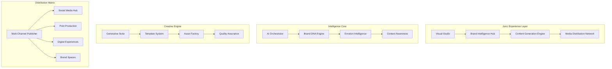

# 🎯 Juicc Brand OS: The Ultimate Brand, Communication & Media OS

**Vision**: A revolutionary operating system for brands that transforms static asset management into dynamic, intelligent brand experiences.

**Tagline**: _Where Brands Come Alive_

---

## 🏗️ Enhanced Architecture Overview

### Core Philosophy

Juicc Brand OS is designed around **3 Revolutionary Principles**:

1. **Fluid Brand Experiences** - Brands that adapt, evolve, and respond in real-time
2. **Intelligent Communication** - AI-powered content that understands context and emotion
3. **Seamless Media Orchestration** - Unified control across all brand touchpoints

### System Architecture



---

## 🎨 Enhanced UX/UI Design System

### Design Principles

1. **Immersive Workspaces** - Full-screen creative environments
2. **Intelligent Assistance** - AI helpers that anticipate needs
3. **Fluid Interactions** - Smooth, gesture-based navigation
4. **Contextual Interfaces** - UI that adapts to current task

### Visual Language

- **Gradient Aesthetics** - Dynamic color flows that reflect brand emotions
- **Glass Morphism** - Translucent layers with depth and dimension
- **Micro-interactions** - Subtle animations that provide feedback
- **Adaptive Layouts** - Interfaces that reorganize based on content

### Key UI Components

#### 1. **Brand Canvas**

- Infinite creative workspace
- AI-powered suggestion overlays
- Real-time collaboration cursors
- Gesture-based asset manipulation

#### 2. **Intelligence Panel**

- Floating AI assistant with personality
- Contextual suggestions and insights
- Voice interaction capabilities
- Emotional response indicators

#### 3. **Content Stream**

- Infinite scroll of brand content
- Smart filtering and categorization
- Predictive content loading
- Social engagement metrics

#### 4. **Media Orchestrator**

- Visual timeline for campaign planning
- Drag-and-drop content sequencing
- Multi-platform preview system
- Automated publishing workflows

---

## 🔧 Technical Implementation Plan

### Phase 1: Core Infrastructure (Week 1-2)

#### Enhanced Directus Extensions

```javascript
// juicc-brand-core/extensions/brand-intelligence.js
export default ({ router, services }) => {
  // Brand DNA Analysis
  router.post("/brands/:id/analyze-dna", async (req, res) => {
    const analysis = await BrandDNAAnalyzer.analyze(req.params.id);
    res.json(analysis);
  });

  // Emotional Profile Generation
  router.post("/brands/:id/emotional-profile", async (req, res) => {
    const profile = await EmotionAnalyzer.generateProfile(req.params.id);
    res.json(profile);
  });

  // Content Prediction Engine
  router.post("/brands/:id/predict-content", async (req, res) => {
    const predictions = await ContentPredictor.generate(
      req.params.id,
      req.body
    );
    res.json(predictions);
  });
};
```

#### Advanced AI Orchestrator

```javascript
// juicc-ai-orchestrator/src/brand-intelligence-engine.js
export class BrandIntelligenceEngine {
  constructor() {
    this.emotionAnalyzer = new EmotionAnalyzer();
    this.contextEngine = new ContextEngine();
    this.creativeEngine = new CreativeEngine();
    this.qualityAssurance = new QualityAssurance();
  }

  async generateBrandExperience(brandId, context) {
    // 1. Analyze brand DNA
    const brandDNA = await this.analyzeBrandDNA(brandId);

    // 2. Understand emotional context
    const emotionalProfile = await this.emotionAnalyzer.getContextualProfile(
      brandDNA,
      context
    );

    // 3. Generate creative concepts
    const concepts = await this.creativeEngine.generateConcepts(
      brandDNA,
      emotionalProfile
    );

    // 4. Validate and optimize
    const validatedConcepts = await this.qualityAssurance.validate(concepts);

    return {
      brandDNA,
      emotionalProfile,
      concepts: validatedConcepts,
      confidence: this.calculateOverallConfidence(validatedConcepts),
    };
  }
}
```

### Phase 2: Creative Engine (Week 3-4)

#### Template System 2.0

```javascript
// juicc-creative-engine/src/template-system.js
export class JuiccTemplateSystem {
  constructor() {
    this.templateEngine = new Handlebars();
    this.dynamicStyles = new DynamicStyleEngine();
    this.contentGenerator = new AIContentGenerator();
  }

  async generateBrandBook(brandId, options = {}) {
    // 1. Extract brand DNA
    const brandDNA = await this.extractBrandDNA(brandId);

    // 2. Generate dynamic styles
    const styles = await this.dynamicStyles.generate(brandDNA);

    // 3. Create content variations
    const content = await this.contentGenerator.generateVariations(
      brandDNA,
      options
    );

    // 4. Assemble final templates
    const templates = await this.assembleTemplates(brandDNA, styles, content);

    return {
      html: await this.renderHTML(templates),
      css: styles.generatedCSS,
      pdf: await this.generatePDF(templates),
      interactive: await this.generateInteractive(templates),
    };
  }
}
```

#### Generative Asset Factory

```javascript
// juicc-creative-engine/src/asset-factory.js
export class AssetFactory {
  constructor() {
    this.imageGenerator = new ImageGenerator();
    this.videoGenerator = new VideoGenerator();
    this.audioGenerator = new AudioGenerator();
    this.textGenerator = new TextGenerator();
  }

  async generateAsset(type, brandDNA, specifications) {
    switch (type) {
      case "logo_variations":
        return await this.generateLogoVariations(brandDNA, specifications);
      case "social_media_templates":
        return await this.generateSocialTemplates(brandDNA, specifications);
      case "video_content":
        return await this.generateVideoContent(brandDNA, specifications);
      case "brand_voice_samples":
        return await this.generateVoiceSamples(brandDNA, specifications);
      default:
        throw new Error(`Unknown asset type: ${type}`);
    }
  }
}
```

### Phase 3: Enhanced UX/UI (Week 5-6)

#### React Component Library

```jsx
// juicc-ui/src/components/BrandCanvas.jsx
export const BrandCanvas = ({ brandId, collaborationMode }) => {
  const [assets, setAssets] = useState([]);
  const [aiSuggestions, setAiSuggestions] = useState([]);
  const [collaborators, setCollaborators] = useState([]);

  return (
    <div className="brand-canvas">
      <InfiniteWorkspace>
        <AssetLibrary assets={assets} />
        <AISuggestionPanel suggestions={aiSuggestions} />
        <CollaborationCursors users={collaborators} />
        <GestureInteractions onAssetCreate={handleAssetCreate} />
      </InfiniteWorkspace>
    </div>
  );
};
```

#### AI Assistant Interface

```jsx
// juicc-ui/src/components/IntelligenceAssistant.jsx
export const IntelligenceAssistant = ({ brandId, context }) => {
  const [messages, setMessages] = useState([]);
  const [isThinking, setIsThinking] = useState(false);
  const [emotionalState, setEmotionalState] = useState("neutral");

  return (
    <FloatingPanel className="intelligence-assistant">
      <PersonalityIndicator state={emotionalState} />
      <ConversationHistory messages={messages} />
      <VoiceInterface onTranscript={handleVoiceInput} />
      <SuggestionCarousel suggestions={getSuggestions(context)} />
      <ThinkingIndicator active={isThinking} />
    </FloatingPanel>
  );
};
```

### Phase 4: Media Distribution (Week 7-8)

#### Multi-Channel Publisher

```javascript
// juicc-distribution/src/publisher.js
export class MediaPublisher {
  constructor() {
    this.channels = {
      social: new SocialMediaPublisher(),
      print: new PrintPublisher(),
      digital: new DigitalPublisher(),
      physical: new PhysicalPublisher(),
    };
  }

  async publishCampaign(campaign, targets) {
    const results = await Promise.all(
      targets.map((target) =>
        this.channels[target.type].publish(campaign, target)
      )
    );

    return {
      published: results.filter((r) => r.success),
      failed: results.filter((r) => !r.success),
      analytics: await this.gatherAnalytics(results),
    };
  }
}
```

---

## 🚀 Implementation Priority Matrix

| Feature                       | Impact | Effort    | Priority |
| ----------------------------- | ------ | --------- | -------- |
| Brand DNA Analysis            | High   | Medium    | 1        |
| AI-Powered Content Generation | High   | High      | 2        |
| Enhanced UI Components        | High   | Medium    | 3        |
| Template System               | Medium | Medium    | 4        |
| Media Distribution            | Medium | High      | 5        |
| Collaboration Features        | Medium | High      | 6        |
| Voice Interface               | Low    | High      | 7        |
| AR/VR Integration             | Low    | Very High | 8        |

---

## 🎯 Success Metrics

### User Engagement

- **Session Duration**: Target 45+ minutes average
- **Interaction Rate**: 200+ interactions per session
- **Creation Velocity**: 10+ assets created per session

### Brand Performance

- **Consistency Score**: 95%+ brand compliance
- **Engagement Lift**: 40%+ increase in audience engagement
- **Time to Market**: 70% reduction in campaign launch time

### Platform Health

- **Uptime**: 99.9% availability
- **Response Time**: <200ms for AI operations
- **User Satisfaction**: 4.8/5 star rating

---

## 🔄 Development Roadmap

### Sprint 1 (Week 1-2): Foundation

- Set up enhanced Directus instance
- Implement Brand DNA Analysis
- Create basic UI framework

### Sprint 2 (Week 3-4): Intelligence

- Build AI Orchestrator
- Implement Content Generation
- Create Template System

### Sprint 3 (Week 5-6): Experience

- Develop Enhanced UI Components
- Implement AI Assistant
- Create Collaboration Features

### Sprint 4 (Week 7-8): Distribution

- Build Media Publisher
- Implement Analytics Dashboard
- Create Export Capabilities

---

## 🎨 Design System Specifications

### Color Palette

- **Primary**: Dynamic gradient based on brand emotions
- **Secondary**: Adaptive complementary colors
- **Accent**: Emotional response indicators

### Typography

- **Headlines**: Variable fonts that adapt to brand voice
- **Body**: Contextually appropriate readability
- **UI**: Clear hierarchy with emotional weight

### Spacing

- **Micro**: 4px base unit for detailed elements
- **Macro**: 24px base unit for layout sections
- **Dynamic**: Spacing that responds to content density

### Animations

- **Duration**: 200-500ms for smooth transitions
- **Easing**: Custom curves that reflect brand personality
- **Feedback**: Subtle responses to user interactions

---

Juicc Brand OS represents the future of brand management - where intelligence meets creativity, and static assets become dynamic experiences. This architecture ensures that every interaction with the brand feels personal, relevant, and alive.
